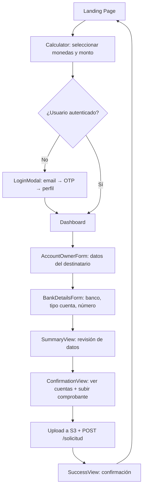

# Llanuda App Front — Análisis Completo del Proyecto

> Última actualización: 2 de mayo de 2026

---

## 1. Resumen General

**Llanura** es una aplicación web de remesas internacionales enfocada en envíos de dinero entre Chile y Venezuela (y potencialmente otros países de Latinoamérica). Permite a los usuarios calcular tasas de cambio en tiempo real, registrar destinatarios, ingresar datos bancarios y subir comprobantes de transferencia. Incluye un asistente AI conversacional que puede completar todo el flujo de envío a través de chat.

- **Nombre del paquete:** `new-app-front`
- **Dominio de producción:** `llanura.com` (referenciado en la UI)
- **Backend API:** `https://backend.wesyncro.click`
- **Propietario (tenant ID):** `28347737473` (env var `VITE_PROPIETARIO`)

---

## 2. Stack Tecnológico

| Categoría          | Tecnología                                   | Versión   |
|--------------------|----------------------------------------------|-----------|
| Framework          | React                                        | 19.2.0    |
| Bundler            | Vite                                         | 7.2.4     |
| UI Library         | MUI (Material UI)                            | 6.5.0     |
| State Management   | Redux Toolkit + React-Redux                  | 2.11.2    |
| Routing            | React Router DOM                             | 7.14.0    |
| Iconos             | react-icons (HeroIcons v2, Material Design)  | 5.6.0     |
| Tipografía         | Inter (Google Fonts) + Roboto (@fontsource)  |           |
| Linting            | ESLint                                       | 9.39.1    |
| Plugin React       | @vitejs/plugin-react                         | 5.1.1     |

### Scripts disponibles

```bash
npm run dev      # Servidor de desarrollo (Vite)
npm run build    # Build de producción
npm run lint     # Linting con ESLint
npm run preview  # Preview del build de producción
```

> ⚠️ **No existe script `start`**. Para desarrollo usar `npm run dev`.

---

## 3. Arquitectura del Proyecto

```
llanuda-app-front/
├── index.html                  # Entry point HTML (Inter font, smooth scroll)
├── vite.config.js              # Vite config (react plugin, .vite cache)
├── .env                        # VITE_API_BASE, VITE_PROPIETARIO
├── .env.development.local      # Override local para API base
├── package.json
├── public/
│   └── assets/
│       ├── person.png          # Hero marketing (6.2MB)
│       ├── person2.png         # Calculator section (5.5MB)
│       ├── phone.png           # Download banner (1MB)
│       ├── hero.png            # Hero image (618KB)
│       └── download.png        # Download asset (570KB)
└── src/
    ├── main.jsx                # React root + providers (BrowserRouter, Redux, StrictMode)
    ├── App.jsx                 # Layout principal, routing, theme toggle, navegación
    ├── App.css                 # CSS legacy del calculador (variables CSS, clases .card, .hero, etc.)
    ├── index.css               # Global: animaciones (float, fadeIn), scrollbar custom
    ├── theme.js                # MUI Theme factory con soporte light/dark
    ├── assets/
    │   └── react.svg
    ├── components/             # 16 componentes (sin subdirectorios)
    │   ├── Calculator.jsx          # Calculadora de cambio (componente principal)
    │   ├── Dashboard.jsx           # Wizard multi-step de transferencia
    │   ├── Navbar.jsx              # AppBar con glassmorphism, scroll-aware
    │   ├── Footer.jsx              # Footer con links, social, contacto
    │   ├── MarketingBanner.jsx     # Hero banner con tasas en vivo
    │   ├── DownloadBanner.jsx      # CTA para descargar la app móvil
    │   ├── LoginModal.jsx          # Autenticación OTP (email → código → perfil)
    │   ├── AIChatWidget.jsx        # Widget flotante de chat AI (FAB)
    │   ├── AIChatDashboard.jsx     # Vista completa del chat AI (full-page, NO enrutada)
    │   ├── AccountOwnerForm.jsx    # Form: datos del destinatario
    │   ├── BankDetailsForm.jsx     # Form: datos bancarios (banco, pago móvil, cuenta)
    │   ├── SummaryView.jsx         # Resumen de la transferencia antes de confirmar
    │   ├── ConfirmationView.jsx    # Carga de comprobante + cuentas bancarias propias
    │   ├── SuccessView.jsx         # Pantalla de éxito post-envío
    │   ├── StaticPage.jsx          # Páginas estáticas (términos, privacidad, contacto, etc.)
    │   └── Profile.jsx             # Perfil de usuario (standalone route)
    ├── context/
    │   └── AuthContext.jsx         # Context de autenticación (localStorage-backed)
    ├── services/
    │   └── api.js                  # Capa HTTP centralizada (fetch wrapper)
    ├── store/
    │   ├── index.js                # Redux store config + persistence a localStorage
    │   └── slices/
    │       ├── transactionSlice.js # Estado de la transacción (cálculo, destinatario, banco)
    │       └── uiSlice.js          # Estado del UI (isChatOpen)
    └── views/                      # Directorio vacío (sin uso actual)
```

---

## 4. Routing

Definido directamente en `App.jsx` usando `<Routes>`:

| Ruta              | Componente                | Descripción                                        |
|-------------------|---------------------------|----------------------------------------------------|
| `/`               | Landing Page inline       | Marketing banner + Calculator + Stats              |
| `/dashboard`      | `<Dashboard />`           | Wizard multi-step de transferencia                 |
| `/profile`        | `<Profile />`             | Perfil de usuario (requiere auth implícitamente)   |
| `/p/:slug`        | `<StaticPage />`          | Páginas estáticas por slug                         |

### Slugs de páginas estáticas disponibles
`terminos`, `privacidad`, `cookies`, `seguridad`, `nosotros`, `carreras`, `contacto`

### Componentes globales (fuera de Routes)
- `<Navbar />` — siempre visible
- `<AIChatWidget />` — FAB flotante siempre visible
- `<DownloadBanner />` — solo en ruta `/`
- `<Footer />` — siempre visible
- `<LoginModal />` — modal controlado por estado

---

## 5. State Management

### 5.1. Redux Store (Redux Toolkit)

#### `transactionSlice`
Estado central de la transacción, con persistencia manual a `localStorage` (key: `llanuda_pending_tx`).

```javascript
{
  calculation: { from, to, amount, total, rate, fee },
  recipient:   { firstName, lastName, docType, docNumber, nickname, saveRecipient },
  bank:        { bank, isPagoMovil, accountType, accountNumber },
  status:      'idle' | 'calculating' | 'chat_active' | 'complete',
  error:       null | string
}
```

**Actions disponibles:**
- `updateCalculation(payload)` — merge parcial de cálculo
- `updateRecipient(payload)` — merge parcial de destinatario
- `updateBank(payload)` — merge parcial de banco
- `resetTransaction()` — vuelve al estado por defecto
- `setTransactionStatus(status)` — cambia el status
- `syncFullTransaction({ calculation, recipient, bank })` — merge profundo (usado por AI)

#### `uiSlice`
Estado simple de UI.

```javascript
{ isChatOpen: boolean }
```

**Actions:** `toggleChat()`, `openChat()`, `closeChat()`

### 5.2. AuthContext (React Context)

Manejo de autenticación basado en `localStorage` (key: `app_user`).

```javascript
{
  user:    null | { email, name, phone, token },
  loading: boolean,
  login:   (userData) => void,
  logout:  () => void
}
```

- Se inicializa desde `localStorage` al montar
- El token JWT se adjunta automáticamente a las peticiones HTTP vía `api.js`

---

## 6. Capa de Servicios / API

Archivo: `src/services/api.js`

### Configuración

| Variable             | Valor                                                     |
|----------------------|-----------------------------------------------------------|
| `API_BASE`           | `https://backend.wesyncro.click` (o `localhost:5004` si `DEBUG=true`) |
| `EXCHANGE_PATH`      | `/api/1.0/custom-apps/exchange-public`                    |
| `PROPIETARIO`        | Desde `VITE_PROPIETARIO` env var                          |

### Headers automáticos
- `Content-Type: application/json`
- `X-Propietario: {propietario}`
- `Authorization: Bearer {token}` (si hay usuario en localStorage)

### URL Resolution
- URLs que empiezan con `http` → se usan directamente
- URLs que empiezan con `/api` → `API_BASE + endpoint`
- Cualquier otra → `API_BASE + EXCHANGE_PATH + endpoint`

### Métodos exportados
```javascript
api.get(endpoint, options)
api.post(endpoint, body, options)
api.put(endpoint, body, options)
api.delete(endpoint, options)
api.raw  // fetch nativo para uploads S3
```

### Endpoints consumidos (inferidos del código)

| Endpoint                                 | Método | Componente            | Descripción                               |
|------------------------------------------|--------|-----------------------|-------------------------------------------|
| `/currencies`                            | GET    | Calculator            | Lista de monedas disponibles              |
| `/rates`                                 | GET    | Calculator, Marketing | Tasas de cambio activas                   |
| `/status`                                | GET    | Calculator, BankForm  | Estado del servicio (open/closed, bancos) |
| `/auth/init`                             | POST   | LoginModal            | Inicia OTP (envía código al email)        |
| `/auth/verify`                           | POST   | LoginModal            | Verifica código OTP                       |
| `/auth/complete`                         | POST   | LoginModal            | Completa perfil de nuevo usuario          |
| `/recipients?email=`                     | GET    | Dashboard             | Destinatarios guardados del usuario       |
| `/solicitud`                             | POST   | Dashboard             | Crea la solicitud de transferencia        |
| `/bank-accounts`                         | GET    | ConfirmationView      | Cuentas bancarias propias de Llanura      |
| `/ai-chat`                               | POST   | AIChatWidget/Dashboard| Chat con asistente AI                     |
| `/api/1.0/medios/presigne-url-public`    | POST   | Dashboard             | Obtiene URL pre-firmada para S3           |

---

## 7. Flujos Principales

### 7.1. Flujo de Transferencia (Manual)



### 7.2. Flujo de Transferencia (AI Chat)

```mermaid
flowchart TD
    A[FAB "Asistente AI" click] --> B[AIChatWidget abre]
    B --> C{¿Hay transacción pendiente?}
    C -- Sí --> D[Dialog: ¿Retomar o nueva?]
    C -- No --> E[Chat con AI]
    D --> E
    E --> F[AI extrae datos vía POST /ai-chat]
    F --> G[syncFullTransaction actualiza Redux]
    G --> H[Preview en vivo muestra progreso]
    H --> I[Botón "Finalizar"]
    I --> J{¿Autenticado?}
    J -- No --> K[Redirige con ?triggerLogin=true]
    J -- Sí --> L[Navigate a /dashboard con datos en Redux]
```

### 7.3. Flujo de Autenticación (Passwordless OTP)

```
1. Usuario ingresa email → POST /auth/init
2. Backend envía código por email
3. Usuario ingresa código (6 dígitos) → POST /auth/verify
4. Si es nuevo (status: pending_profile) → formulario nombre + teléfono → POST /auth/complete
5. Si ya existía (status: complete) → login directo con token
6. Token se guarda en localStorage como parte del objeto user
```

---

## 8. Sistema de Diseño

### 8.1. Theme (MUI)

El tema soporta **light** y **dark** mode, controlado por toggle en el Navbar y persistido en `localStorage` (key: `theme_mode`).

**Colores principales:**
| Token             | Light              | Dark               |
|--------------------|--------------------|---------------------|
| `primary.main`    | `#dd3e00`          | `#dd3e00`           |
| `primary.light`   | `#ff6a3d`          | `#ff6a3d`           |
| `secondary.main`  | `#ff7a45`          | `#ff7a45`           |
| `background.default` | `#f8fafc`       | `#0b1120`           |
| `background.paper`| `#ffffff`          | `#111827`           |
| `text.primary`    | `#0f172a`          | `#f8fafc`           |
| `text.secondary`  | `#64748b`          | `#94a3b8`           |

**Tipografía:** `Inter`, `Roboto`, `Helvetica`, `Arial`

**Tokens de forma:**
- `borderRadius` global: `18px`
- Cards: `borderRadius: 24px`
- Buttons: `borderRadius: 12px`, `textTransform: none`, `fontWeight: 700`

### 8.2. Variables CSS Legacy (`App.css`)

Existen variables CSS (`--ink-900`, `--accent-600`, etc.) que se usaban en una versión anterior del Calculator. Parcialmente supersedidas por el tema MUI, pero las clases CSS aún existen.

### 8.3. Animaciones globales (`index.css`)

- `float` — movimiento vertical suave (usado en imágenes hero)
- `fadeInLeft` / `fadeInRight` — entrada con desplazamiento lateral
- Scrollbar personalizada con colores del brand (`rgba(221, 62, 0, ...)`)

### 8.4. Patrones visuales recurrentes

- **Glassmorphism en Navbar** — `backdropFilter: blur(20px) saturate(180%)`
- **Box shadows branded** — `rgba(221, 62, 0, 0.2-0.4)` en botones y cards
- **Gradient text** — Logo "Llanura" usa `background-clip: text` con gradiente naranja
- **Decorative circles** — Círculos semitransparentes absolutos como fondo decorativo
- **Sticky headers** — TransactionFeedbackHeader en Dashboard usa `position: sticky`

---

## 9. Componentes — Detalle

### Calculator (`22.7KB` — componente más grande)
- Obtiene `/currencies`, `/rates`, `/status` al montar
- Soporta múltiples monedas (CLP, USD, EUR, ARS, BRL, COP, MXN, PEN, GBP)
- Operaciones de conversión: `multiply` o `divide` (según `rateDoc.operation`)
- Fee configurable vía `VITE_FEE` (default: 0)
- Input con formato chileno (puntos como separador de miles, coma para decimales)
- Estado `isClosed` muestra overlay de bloqueo con efecto blur
- Loading muestra Backdrop fullscreen con animación pulse
- Si el usuario no está autenticado al hacer click en "Siguiente", abre LoginModal

### Dashboard (`14.5KB`)
- Wizard multi-step: `OWNER_FORM → BANK_FORM → SUMMARY → CONFIRMATION → SUCCESS`
- Recibe datos del Calculator vía `pendingTransfer` prop o del Redux store (vía AI)
- Detección de "AI complete": si Redux tiene calculation + recipient + bank, salta a SUMMARY
- TransactionFeedbackHeader sticky muestra resumen de la conversión con CTA de edición
- Upload a S3 mediante URL pre-firmada
- Payload de `/solicitud` incluye: propietario, owner, bank, cálculo, imageUrl, user info

### AIChatWidget (`16KB`)
- Floating Action Button (FAB) con ícono de sparkles
- Panel de chat estilo mensajero con panel izquierdo de preview
- Envío de imágenes (base64) al backend AI
- `syncFullTransaction` actualiza Redux en tiempo real con la respuesta del AI
- Botón "Finalizar" con animación de pulso verde cuando la transacción está completa
- Diálogo de "¿Retomar anterior?" al abrir si hay datos pendientes

### AIChatDashboard (`13.5KB`)
- Versión full-page del chat AI (no está enrutada actualmente)
- Layout split: preview (40%) + chat (60%)
- **Bug**: falta `try {` antes del bloque `catch` en `handleSendMessage` (línea ~120)

### LoginModal (`7.4KB`)
- 3 steps: `email → code → profile`
- OTP de 6 dígitos con input centrado y letter-spacing
- Flujo: `/auth/init` → `/auth/verify` → `/auth/complete` (si es nuevo)

### AccountOwnerForm (`10KB`)
- Autocomplete con destinatarios guardados (`savedRecipients`)
- Tipos de documento: V, E, J, P (documentos venezolanos)
- Switch para guardar destinatario para futuro uso
- Campos: nombres, apellidos, tipo/número de documento, apodo

### BankDetailsForm (`7.8KB`)
- Carga bancos desde `/status` → `supportedBanks` (filtrados por `isActive`)
- Soporte para Pago Móvil (teléfono) o cuenta bancaria (20 dígitos)
- Si es pago móvil, no muestra tipo de cuenta
- Input numérico con filtro de caracteres no-numéricos

### ConfirmationView (`6.3KB`)
- Carga cuentas bancarias de Llanura desde `/bank-accounts`
- Muestra cada cuenta con: banco, titular, RUT, tipo, número, email
- Upload de comprobante (archivo de imagen, opcional)

### MarketingBanner (`9KB`)
- Hero principal con fondo `#dd3e00`
- Selector de par de monedas (dropdown glassmorphic)
- CTA "Crea tu cuenta" + "Enviar rápido" (abre AI Chat)
- Imagen decorativa flotante con animación

### Navbar (`8.3KB`)
- AppBar fijo con `ElevationScroll` (cambia opacity/blur al hacer scroll)
- Navegación: Inicio, Sobre Llanura, Contacto
- Toggle dark/light mode
- Menú de usuario: Mi Perfil, Cerrar Sesión
- Si no hay usuario, click en avatar abre LoginModal
- Logo con gradiente de texto animado

---

## 10. Persistencia de Datos

| Dato                | Storage        | Key                    | Formato       |
|---------------------|----------------|------------------------|---------------|
| Transacción activa  | localStorage   | `llanuda_pending_tx`   | JSON (Redux)  |
| Usuario autenticado | localStorage   | `app_user`             | JSON          |
| Tema (light/dark)   | localStorage   | `theme_mode`           | string        |

La persistencia de la transacción se hace vía `store.subscribe()` en `store/index.js`, que serializa el estado completo del slice `transaction` a localStorage en cada cambio.

---

## 11. Assets Estáticos

| Archivo         | Ubicación              | Tamaño  | Uso                                  |
|-----------------|------------------------|---------|--------------------------------------|
| `person.png`    | `/public/assets/`      | 6.2MB   | MarketingBanner hero image           |
| `person2.png`   | `/public/assets/`      | 5.5MB   | Calculator left panel image          |
| `phone.png`     | `/public/assets/`      | 1MB     | DownloadBanner phone mockup          |
| `hero.png`      | `/public/assets/`      | 618KB   | (Disponible, sin referencia directa) |
| `download.png`  | `/public/assets/`      | 570KB   | (Disponible, sin referencia directa) |

> ⚠️ **Las imágenes son muy pesadas** (~14MB total). Considerar optimización con WebP/AVIF y lazy loading.

---

## 12. Observaciones y Posibles Mejoras

### Bugs detectados
1. **`AIChatDashboard.jsx` línea ~109**: Falta `try {` antes del bloque asíncrono que tiene `catch`. Esto causará un error de sintaxis si se intenta importar este componente.
2. **`main.jsx`**: Se declara `globalStyles` pero nunca se usa en el render tree.
3. **`ThemeProvider`** se usa doblemente: una vez en `main.jsx` (a través del import de `theme.js` que no se usa) y otra en `AppContent` con el tema dinámico. El de `main.jsx` no está activo.

### Arquitectura
- **`views/` vacío**: Directorio sin uso. Los componentes que actúan como vistas (`Dashboard`, `Profile`) están en `components/`.
- **`AIChatDashboard.jsx` sin ruta**: Componente completo pero no enrutado. Parece una versión anterior/alternativa del `AIChatWidget`.
- **CSS legacy**: `App.css` contiene estilos que ya no se usan activamente (el Calculator ahora usa MUI sx props). Podría limpiarse.

### Performance
- **Imágenes sin optimizar**: ~14MB en assets estáticos. Se recomienda convertir a WebP y aplicar responsive images.
- **Sin lazy loading de rutas**: Todos los componentes se cargan eagerly. Se beneficiaría de `React.lazy()` + `Suspense` para `/dashboard`, `/profile`, y `/p/:slug`.
- **Múltiples llamadas duplicadas a `/rates` y `/status`**: Tanto `Calculator` como `MarketingBanner` llaman a `/rates` independientemente. Centralizar en Redux o SWR.

### Seguridad
- El token se guarda en `localStorage` (susceptible a XSS). Para producción, considerar `httpOnly cookies`.
- `X-Propietario` header actúa como tenant ID — revisar que el backend lo valide correctamente.

### UX
- **No hay manejo de rutas protegidas**: `/dashboard` y `/profile` no redirigen a login si el usuario no está autenticado.
- **Formularios sin feedback visual de validación**: Los forms usan `required` nativo pero no muestran errores inline de MUI.
- **El menú hamburguesa mobile no tiene funcionalidad**: El `<IconButton>` con `<HiMenu />` no tiene `onClick`.

---

## 13. Variables de Entorno

| Variable             | Descripción                              | Default                            |
|----------------------|------------------------------------------|------------------------------------|
| `VITE_API_BASE`      | URL base del backend                     | `https://backend.wesyncro.click`   |
| `VITE_PROPIETARIO`   | ID del propietario/tenant                | `28347737473`                      |
| `VITE_EXCHANGE_PATH` | Path base de la API de exchange          | `/api/1.0/custom-apps/exchange-public` |
| `VITE_FEE`           | Comisión fija por transacción            | `0`                                |
